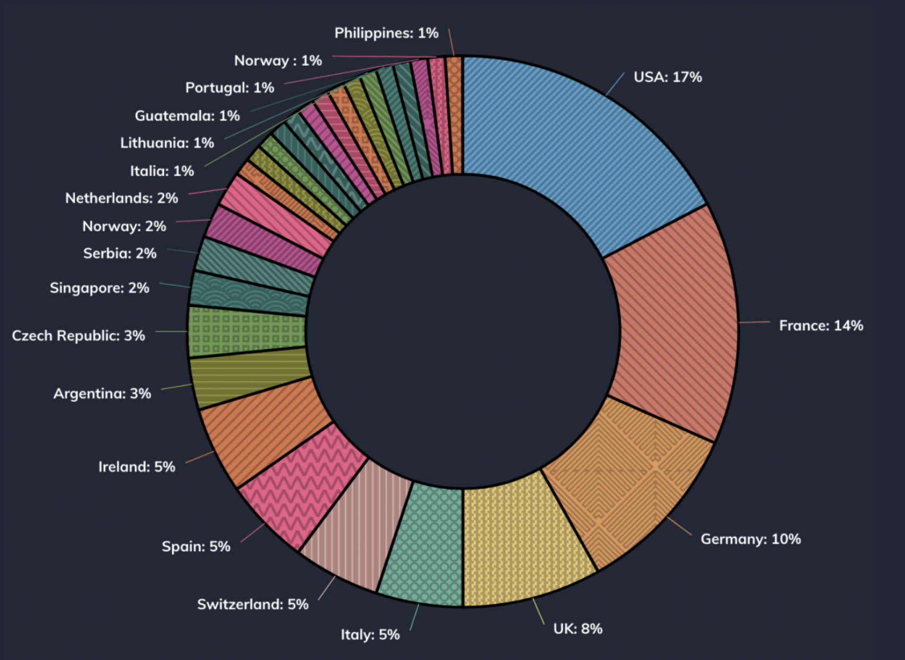
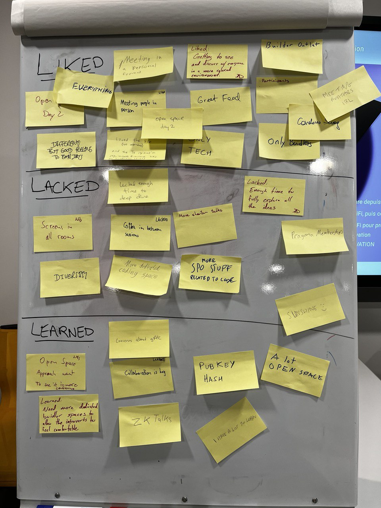

The first edition of _Cardano Buidler Fest_ is over, and it felt pretty much like a successful wedding party: Exhilarating, exhausting, stressful, intense for the organisers, and a lot of fun for the attendees!

We want to share with the wider Cardano community a glimpse of all the great stuff that happened in those two days, what participants said about it, and how we organised such an event, with the hope that Cardano enthusiasts all over the world will feel empowered to organise their own particular version of Buidler Fest. [Manu](https://www.manudejean.fr) -- our professional photographer -- took a lot of great pictures, video rushes and interviews we are currently post-producing with him. Here is a small sample that can give one a taste of how great Buidler Fest was, or fuel fond memories for those who attended! For the complete set of photos, head over to the [gallery](/gallery)!



## What happened?

It's quite hard to summarize two days packed with engaging presentations, lively discussions, joyful dinners, and passionate debates into a few sentences or paragraphs. We designed Buidler Fest to be a great experience and like all great experiences, it has to be lived and not watched from the side! However, thanks to Manu and all attendees who helped making the event live on social media, we have a lot of footage available from interviews and impromptu capture of instants. While we are still working on compiling interviews that many kindly conducted, we are happy to share a short recap' video which should give a good glimpse of the event and the vibes, compacted in two minutes.



### Key figures

* There were officially **108 registered participants**, of which 102 were present, plus 1 person that just popped up all-the-way from Peru and tried their luck! Luckily, there were enough no-shows and the hotel was kind enough to accomodate this late comer.
* Those participants **proposed 53 sessions** for the first day, following the announcement of the _Call for Proposals_ on [Sessionize](https://sessionize.com/cardano-buidler-fest/), out of which **15 were ultimately accepted**. On the second day, **29 more sessions** were proposed which of course were all accepted!
* Registrations were **sold out 32 days** after the initial announcement of the event, on the 24th of December of 2023. This lead to **127 transaction on-chain**, out of which 15 were invalid, in the sense they did not comply with the requirements from the [registration page](/register).
* Only one woman registered for the event, although there were a few more present accompanying their registered partner. This is definitely something we need to improve for following editions

Buidlers Fest participants' origin is pretty diverse, with a large majority from the Americas and Europe though, as the following graph shows.

## Participants feedback

At the end of the second day, we did a quick live retrospective, asking each participant to share with the audience one thing they liked, one thing they lacked, and one thing they learn from those two days. Here is a picture of the end result from this quick survey:

We also gathered some feedback from in person conversations, during or after the conference. The main points were:

* The sizing of the conference felt about "just right", small enough one could hope to interact with every other participant, large enough to ensure diversity of background and viewpoints
* The venue was great, with the right configuration of space, e.g. a large and comfy central area (the lobby), convenient and well equipped rooms, a nice amphitheatre for the first day. The lack of smaller, isolated space, dedicate to coding was highlighted by some participants, as well as the lack of a constant supply of caffeine (coffee was only served during the breaks)!
* The food was great, but what else can you expect in France?
* As already mentioned, the conferenced lacked some diversity: Only one woman, and no participant from Africa, registered. This seems to be a consequence of a tech-focused event, as it's quite well-known tech and STEM is not very diverse but of course this is no excuse.
* The "vibe" for the two days felt pretty different, and _Open Space_ (un)conference style came as a good surprise to quite a few!
* The 100% focus on tech, and lack of marketing was much appreciated. Having more introductory/starter talks would have been appreciated, as well as some more talks and sessions on covering operational aspects of Cardano and notably the SPOs work.
* Participants appreciated the impromptu conversations that an in-person event allows, the surprises that come from bumping into individuals you've only met online
* And they regret not having enough time and space to dive more deeply into each topic, but that's unfortunately the fate of every successful event to generate frustration!

## Your retrospectives

And what about hearing directly from the builders? It was our great pleasure to see many of you publish retrospectives and share your experience with everyone! So we thought we could cheer those we've seen:

- [A brilliant and thorough walk-through from Chris, Blink Labs' CEO](https://medium.com/@blinklabs_io/buidler-fest-2024-recap-and-thoughts-d8ccd3dce32e)
- [A succinct albeit cheerful summary on the Cardano Forum from Thomas, Cardano Ambassador](https://forum.cardano.org/t/buidler-fest-from-a-non-technical-perspective/130957)
- [A video from James, Gimbalabs' co-founder, where he shares his outlook & thoughts about the event & the open space](https://www.youtube.com/watch?v=9jUXvyRPc58)

And with that, a mountain of positive feedback on social media!

<aside class="twitter-embeds">
  <article><iframe height="250" scrolling="no" frameborder="0" allowtransparency="true" allowfullscreen="true" class="" src="https://platform.twitter.com/embed/Tweet.html?dnt=false&amp;embedId=twitter-widget-0&amp;features=eyJ0ZndfdGltZWxpbmVfbGlzdCI6eyJidWNrZXQiOltdLCJ2ZXJzaW9uIjpudWxsfSwidGZ3X2ZvbGxvd2VyX2NvdW50X3N1bnNldCI6eyJidWNrZXQiOnRydWUsInZlcnNpb24iOm51bGx9LCJ0ZndfdHdlZXRfZWRpdF9iYWNrZW5kIjp7ImJ1Y2tldCI6Im9uIiwidmVyc2lvbiI6bnVsbH0sInRmd19yZWZzcmNfc2Vzc2lvbiI6eyJidWNrZXQiOiJvbiIsInZlcnNpb24iOm51bGx9LCJ0ZndfZm9zbnJfc29mdF9pbnRlcnZlbnRpb25zX2VuYWJsZWQiOnsiYnVja2V0Ijoib24iLCJ2ZXJzaW9uIjpudWxsfSwidGZ3X21peGVkX21lZGlhXzE1ODk3Ijp7ImJ1Y2tldCI6InRyZWF0bWVudCIsInZlcnNpb24iOm51bGx9LCJ0ZndfZXhwZXJpbWVudHNfY29va2llX2V4cGlyYXRpb24iOnsiYnVja2V0IjoxMjA5NjAwLCJ2ZXJzaW9uIjpudWxsfSwidGZ3X3Nob3dfYmlyZHdhdGNoX3Bpdm90c19lbmFibGVkIjp7ImJ1Y2tldCI6Im9uIiwidmVyc2lvbiI6bnVsbH0sInRmd19kdXBsaWNhdGVfc2NyaWJlc190b19zZXR0aW5ncyI6eyJidWNrZXQiOiJvbiIsInZlcnNpb24iOm51bGx9LCJ0ZndfdXNlX3Byb2ZpbGVfaW1hZ2Vfc2hhcGVfZW5hYmxlZCI6eyJidWNrZXQiOiJvbiIsInZlcnNpb24iOm51bGx9LCJ0ZndfdmlkZW9faGxzX2R5bmFtaWNfbWFuaWZlc3RzXzE1MDgyIjp7ImJ1Y2tldCI6InRydWVfYml0cmF0ZSIsInZlcnNpb24iOm51bGx9LCJ0ZndfbGVnYWN5X3RpbWVsaW5lX3N1bnNldCI6eyJidWNrZXQiOnRydWUsInZlcnNpb24iOm51bGx9LCJ0ZndfdHdlZXRfZWRpdF9mcm9udGVuZCI6eyJidWNrZXQiOiJvbiIsInZlcnNpb24iOm51bGx9fQ%3D%3D&amp;frame=false&amp;hideCard=false&amp;hideThread=false&amp;id=1783460768224014379&amp;lang=en&amp;origin=http%3A%2F%2Flocalhost%3A1313%2Fposts%2F2024-04-26-it-s-over%2F&amp;sessionId=1d4c43cce791d3a7232e01a7897c41e981a5b1e5&amp;theme=light&amp;widgetsVersion=2615f7e52b7e0%3A1702314776716&amp;width=550px" data-tweet-id="1783460768224014379"></iframe></article>

  <article><iframe height="340" scrolling="no" frameborder="0" allowtransparency="true" allowfullscreen="true" title="X Post" src="https://platform.twitter.com/embed/Tweet.html?dnt=false&amp;embedId=twitter-widget-1&amp;features=eyJ0ZndfdGltZWxpbmVfbGlzdCI6eyJidWNrZXQiOltdLCJ2ZXJzaW9uIjpudWxsfSwidGZ3X2ZvbGxvd2VyX2NvdW50X3N1bnNldCI6eyJidWNrZXQiOnRydWUsInZlcnNpb24iOm51bGx9LCJ0ZndfdHdlZXRfZWRpdF9iYWNrZW5kIjp7ImJ1Y2tldCI6Im9uIiwidmVyc2lvbiI6bnVsbH0sInRmd19yZWZzcmNfc2Vzc2lvbiI6eyJidWNrZXQiOiJvbiIsInZlcnNpb24iOm51bGx9LCJ0ZndfZm9zbnJfc29mdF9pbnRlcnZlbnRpb25zX2VuYWJsZWQiOnsiYnVja2V0Ijoib24iLCJ2ZXJzaW9uIjpudWxsfSwidGZ3X21peGVkX21lZGlhXzE1ODk3Ijp7ImJ1Y2tldCI6InRyZWF0bWVudCIsInZlcnNpb24iOm51bGx9LCJ0ZndfZXhwZXJpbWVudHNfY29va2llX2V4cGlyYXRpb24iOnsiYnVja2V0IjoxMjA5NjAwLCJ2ZXJzaW9uIjpudWxsfSwidGZ3X3Nob3dfYmlyZHdhdGNoX3Bpdm90c19lbmFibGVkIjp7ImJ1Y2tldCI6Im9uIiwidmVyc2lvbiI6bnVsbH0sInRmd19kdXBsaWNhdGVfc2NyaWJlc190b19zZXR0aW5ncyI6eyJidWNrZXQiOiJvbiIsInZlcnNpb24iOm51bGx9LCJ0ZndfdXNlX3Byb2ZpbGVfaW1hZ2Vfc2hhcGVfZW5hYmxlZCI6eyJidWNrZXQiOiJvbiIsInZlcnNpb24iOm51bGx9LCJ0ZndfdmlkZW9faGxzX2R5bmFtaWNfbWFuaWZlc3RzXzE1MDgyIjp7ImJ1Y2tldCI6InRydWVfYml0cmF0ZSIsInZlcnNpb24iOm51bGx9LCJ0ZndfbGVnYWN5X3RpbWVsaW5lX3N1bnNldCI6eyJidWNrZXQiOnRydWUsInZlcnNpb24iOm51bGx9LCJ0ZndfdHdlZXRfZWRpdF9mcm9udGVuZCI6eyJidWNrZXQiOiJvbiIsInZlcnNpb24iOm51bGx9fQ%3D%3D&amp;frame=false&amp;hideCard=false&amp;hideThread=false&amp;id=1783441360680313322&amp;lang=en&amp;origin=http%3A%2F%2Flocalhost%3A1313%2Fposts%2F2024-04-26-it-s-over%2F&amp;sessionId=1d4c43cce791d3a7232e01a7897c41e981a5b1e5&amp;theme=light&amp;widgetsVersion=2615f7e52b7e0%3A1702314776716&amp;width=550px" data-tweet-id="1783441360680313322"></iframe></article>

  <article><iframe height="250" scrolling="no" frameborder="0" allowtransparency="true" allowfullscreen="true" title="X Post" src="https://platform.twitter.com/embed/Tweet.html?dnt=false&amp;embedId=twitter-widget-2&amp;features=eyJ0ZndfdGltZWxpbmVfbGlzdCI6eyJidWNrZXQiOltdLCJ2ZXJzaW9uIjpudWxsfSwidGZ3X2ZvbGxvd2VyX2NvdW50X3N1bnNldCI6eyJidWNrZXQiOnRydWUsInZlcnNpb24iOm51bGx9LCJ0ZndfdHdlZXRfZWRpdF9iYWNrZW5kIjp7ImJ1Y2tldCI6Im9uIiwidmVyc2lvbiI6bnVsbH0sInRmd19yZWZzcmNfc2Vzc2lvbiI6eyJidWNrZXQiOiJvbiIsInZlcnNpb24iOm51bGx9LCJ0ZndfZm9zbnJfc29mdF9pbnRlcnZlbnRpb25zX2VuYWJsZWQiOnsiYnVja2V0Ijoib24iLCJ2ZXJzaW9uIjpudWxsfSwidGZ3X21peGVkX21lZGlhXzE1ODk3Ijp7ImJ1Y2tldCI6InRyZWF0bWVudCIsInZlcnNpb24iOm51bGx9LCJ0ZndfZXhwZXJpbWVudHNfY29va2llX2V4cGlyYXRpb24iOnsiYnVja2V0IjoxMjA5NjAwLCJ2ZXJzaW9uIjpudWxsfSwidGZ3X3Nob3dfYmlyZHdhdGNoX3Bpdm90c19lbmFibGVkIjp7ImJ1Y2tldCI6Im9uIiwidmVyc2lvbiI6bnVsbH0sInRmd19kdXBsaWNhdGVfc2NyaWJlc190b19zZXR0aW5ncyI6eyJidWNrZXQiOiJvbiIsInZlcnNpb24iOm51bGx9LCJ0ZndfdXNlX3Byb2ZpbGVfaW1hZ2Vfc2hhcGVfZW5hYmxlZCI6eyJidWNrZXQiOiJvbiIsInZlcnNpb24iOm51bGx9LCJ0ZndfdmlkZW9faGxzX2R5bmFtaWNfbWFuaWZlc3RzXzE1MDgyIjp7ImJ1Y2tldCI6InRydWVfYml0cmF0ZSIsInZlcnNpb24iOm51bGx9LCJ0ZndfbGVnYWN5X3RpbWVsaW5lX3N1bnNldCI6eyJidWNrZXQiOnRydWUsInZlcnNpb24iOm51bGx9LCJ0ZndfdHdlZXRfZWRpdF9mcm9udGVuZCI6eyJidWNrZXQiOiJvbiIsInZlcnNpb24iOm51bGx9fQ%3D%3D&amp;frame=false&amp;hideCard=false&amp;hideThread=false&amp;id=1783208588439400699&amp;lang=en&amp;origin=http%3A%2F%2Flocalhost%3A1313%2Fposts%2F2024-04-26-it-s-over%2F&amp;sessionId=1d4c43cce791d3a7232e01a7897c41e981a5b1e5&amp;theme=light&amp;widgetsVersion=2615f7e52b7e0%3A1702314776716&amp;width=550px" data-tweet-id="1783208588439400699"></iframe></article>

  <article><iframe height="560" scrolling="no" frameborder="0" allowtransparency="true" allowfullscreen="true" title="X Post" src="https://platform.twitter.com/embed/Tweet.html?dnt=false&amp;embedId=twitter-widget-2&amp;features=eyJ0ZndfdGltZWxpbmVfbGlzdCI6eyJidWNrZXQiOltdLCJ2ZXJzaW9uIjpudWxsfSwidGZ3X2ZvbGxvd2VyX2NvdW50X3N1bnNldCI6eyJidWNrZXQiOnRydWUsInZlcnNpb24iOm51bGx9LCJ0ZndfdHdlZXRfZWRpdF9iYWNrZW5kIjp7ImJ1Y2tldCI6Im9uIiwidmVyc2lvbiI6bnVsbH0sInRmd19yZWZzcmNfc2Vzc2lvbiI6eyJidWNrZXQiOiJvbiIsInZlcnNpb24iOm51bGx9LCJ0ZndfZm9zbnJfc29mdF9pbnRlcnZlbnRpb25zX2VuYWJsZWQiOnsiYnVja2V0Ijoib24iLCJ2ZXJzaW9uIjpudWxsfSwidGZ3X21peGVkX21lZGlhXzE1ODk3Ijp7ImJ1Y2tldCI6InRyZWF0bWVudCIsInZlcnNpb24iOm51bGx9LCJ0ZndfZXhwZXJpbWVudHNfY29va2llX2V4cGlyYXRpb24iOnsiYnVja2V0IjoxMjA5NjAwLCJ2ZXJzaW9uIjpudWxsfSwidGZ3X3Nob3dfYmlyZHdhdGNoX3Bpdm90c19lbmFibGVkIjp7ImJ1Y2tldCI6Im9uIiwidmVyc2lvbiI6bnVsbH0sInRmd19kdXBsaWNhdGVfc2NyaWJlc190b19zZXR0aW5ncyI6eyJidWNrZXQiOiJvbiIsInZlcnNpb24iOm51bGx9LCJ0ZndfdXNlX3Byb2ZpbGVfaW1hZ2Vfc2hhcGVfZW5hYmxlZCI6eyJidWNrZXQiOiJvbiIsInZlcnNpb24iOm51bGx9LCJ0ZndfdmlkZW9faGxzX2R5bmFtaWNfbWFuaWZlc3RzXzE1MDgyIjp7ImJ1Y2tldCI6InRydWVfYml0cmF0ZSIsInZlcnNpb24iOm51bGx9LCJ0ZndfbGVnYWN5X3RpbWVsaW5lX3N1bnNldCI6eyJidWNrZXQiOnRydWUsInZlcnNpb24iOm51bGx9LCJ0ZndfdHdlZXRfZWRpdF9mcm9udGVuZCI6eyJidWNrZXQiOiJvbiIsInZlcnNpb24iOm51bGx9fQ%3D%3D&amp;frame=false&amp;hideCard=false&amp;hideThread=false&amp;id=1783467968619270457&amp;lang=en&amp;origin=https%3A%2F%2Fpublish.twitter.com%2F%23&amp;sessionId=6ea439b58c3716abfd71a193741b807f7f4f9253&amp;theme=light&amp;widgetsVersion=2615f7e52b7e0%3A1702314776716&amp;width=400px" data-tweet-id="1783467968619270457"></iframe></article>

  <article><iframe height="440" scrolling="no" frameborder="0" allowtransparency="true" allowfullscreen="true" title="X Post" src="https://platform.twitter.com/embed/Tweet.html?dnt=false&amp;embedId=twitter-widget-3&amp;features=eyJ0ZndfdGltZWxpbmVfbGlzdCI6eyJidWNrZXQiOltdLCJ2ZXJzaW9uIjpudWxsfSwidGZ3X2ZvbGxvd2VyX2NvdW50X3N1bnNldCI6eyJidWNrZXQiOnRydWUsInZlcnNpb24iOm51bGx9LCJ0ZndfdHdlZXRfZWRpdF9iYWNrZW5kIjp7ImJ1Y2tldCI6Im9uIiwidmVyc2lvbiI6bnVsbH0sInRmd19yZWZzcmNfc2Vzc2lvbiI6eyJidWNrZXQiOiJvbiIsInZlcnNpb24iOm51bGx9LCJ0ZndfZm9zbnJfc29mdF9pbnRlcnZlbnRpb25zX2VuYWJsZWQiOnsiYnVja2V0Ijoib24iLCJ2ZXJzaW9uIjpudWxsfSwidGZ3X21peGVkX21lZGlhXzE1ODk3Ijp7ImJ1Y2tldCI6InRyZWF0bWVudCIsInZlcnNpb24iOm51bGx9LCJ0ZndfZXhwZXJpbWVudHNfY29va2llX2V4cGlyYXRpb24iOnsiYnVja2V0IjoxMjA5NjAwLCJ2ZXJzaW9uIjpudWxsfSwidGZ3X3Nob3dfYmlyZHdhdGNoX3Bpdm90c19lbmFibGVkIjp7ImJ1Y2tldCI6Im9uIiwidmVyc2lvbiI6bnVsbH0sInRmd19kdXBsaWNhdGVfc2NyaWJlc190b19zZXR0aW5ncyI6eyJidWNrZXQiOiJvbiIsInZlcnNpb24iOm51bGx9LCJ0ZndfdXNlX3Byb2ZpbGVfaW1hZ2Vfc2hhcGVfZW5hYmxlZCI6eyJidWNrZXQiOiJvbiIsInZlcnNpb24iOm51bGx9LCJ0ZndfdmlkZW9faGxzX2R5bmFtaWNfbWFuaWZlc3RzXzE1MDgyIjp7ImJ1Y2tldCI6InRydWVfYml0cmF0ZSIsInZlcnNpb24iOm51bGx9LCJ0ZndfbGVnYWN5X3RpbWVsaW5lX3N1bnNldCI6eyJidWNrZXQiOnRydWUsInZlcnNpb24iOm51bGx9LCJ0ZndfdHdlZXRfZWRpdF9mcm9udGVuZCI6eyJidWNrZXQiOiJvbiIsInZlcnNpb24iOm51bGx9fQ%3D%3D&amp;frame=false&amp;hideCard=false&amp;hideThread=false&amp;id=1783493684421431728&amp;lang=en&amp;origin=http%3A%2F%2Flocalhost%3A1313%2Fposts%2F2024-04-26-it-s-over%2F&amp;sessionId=1d4c43cce791d3a7232e01a7897c41e981a5b1e5&amp;theme=light&amp;widgetsVersion=2615f7e52b7e0%3A1702314776716&amp;width=550px" data-tweet-id="1783493684421431728"></iframe></article>

  <article><iframe height="520" scrolling="no" frameborder="0" allowtransparency="true" allowfullscreen="true" title="X Post" src="https://platform.twitter.com/embed/Tweet.html?dnt=false&amp;embedId=twitter-widget-1&amp;features=eyJ0ZndfdGltZWxpbmVfbGlzdCI6eyJidWNrZXQiOltdLCJ2ZXJzaW9uIjpudWxsfSwidGZ3X2ZvbGxvd2VyX2NvdW50X3N1bnNldCI6eyJidWNrZXQiOnRydWUsInZlcnNpb24iOm51bGx9LCJ0ZndfdHdlZXRfZWRpdF9iYWNrZW5kIjp7ImJ1Y2tldCI6Im9uIiwidmVyc2lvbiI6bnVsbH0sInRmd19yZWZzcmNfc2Vzc2lvbiI6eyJidWNrZXQiOiJvbiIsInZlcnNpb24iOm51bGx9LCJ0ZndfZm9zbnJfc29mdF9pbnRlcnZlbnRpb25zX2VuYWJsZWQiOnsiYnVja2V0Ijoib24iLCJ2ZXJzaW9uIjpudWxsfSwidGZ3X21peGVkX21lZGlhXzE1ODk3Ijp7ImJ1Y2tldCI6InRyZWF0bWVudCIsInZlcnNpb24iOm51bGx9LCJ0ZndfZXhwZXJpbWVudHNfY29va2llX2V4cGlyYXRpb24iOnsiYnVja2V0IjoxMjA5NjAwLCJ2ZXJzaW9uIjpudWxsfSwidGZ3X3Nob3dfYmlyZHdhdGNoX3Bpdm90c19lbmFibGVkIjp7ImJ1Y2tldCI6Im9uIiwidmVyc2lvbiI6bnVsbH0sInRmd19kdXBsaWNhdGVfc2NyaWJlc190b19zZXR0aW5ncyI6eyJidWNrZXQiOiJvbiIsInZlcnNpb24iOm51bGx9LCJ0ZndfdXNlX3Byb2ZpbGVfaW1hZ2Vfc2hhcGVfZW5hYmxlZCI6eyJidWNrZXQiOiJvbiIsInZlcnNpb24iOm51bGx9LCJ0ZndfdmlkZW9faGxzX2R5bmFtaWNfbWFuaWZlc3RzXzE1MDgyIjp7ImJ1Y2tldCI6InRydWVfYml0cmF0ZSIsInZlcnNpb24iOm51bGx9LCJ0ZndfbGVnYWN5X3RpbWVsaW5lX3N1bnNldCI6eyJidWNrZXQiOnRydWUsInZlcnNpb24iOm51bGx9LCJ0ZndfdHdlZXRfZWRpdF9mcm9udGVuZCI6eyJidWNrZXQiOiJvbiIsInZlcnNpb24iOm51bGx9fQ%3D%3D&amp;frame=false&amp;hideCard=false&amp;hideThread=false&amp;id=1783738084242170278&amp;lang=en&amp;origin=https%3A%2F%2Fpublish.twitter.com%2F%23&amp;sessionId=6ea439b58c3716abfd71a193741b807f7f4f9253&amp;theme=light&amp;widgetsVersion=2615f7e52b7e0%3A1702314776716&amp;width=400px" data-tweet-id="1783738084242170278"></iframe></article>
</aside>

## Famous Last Words

So in short, it was a major success! And what made the Buidler Fest a success is first and foremost the engagement of the participants and speakers: As organisers, we only set the stage but all the credits go to the actors who also happened to be directing themselves in part thanks to the Open Space unconference on the second day!

We would like to say a big ....

